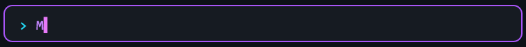
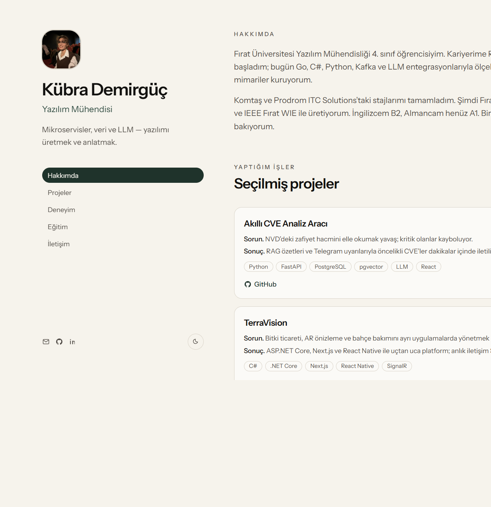
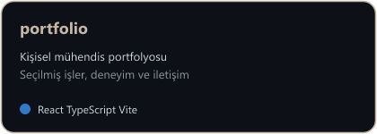
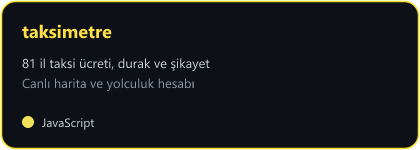

**[Canlı portfolyo](https://kubradmrgc.github.io/portfolio/)** · **[GitHub](https://github.com/kubradmrgc)** · **[LinkedIn](https://www.linkedin.com/in/k%C3%BCbra-demirg%C3%BC%C3%A7-8a058728b)** · **[E-posta](mailto:kubradmrgc965@gmail.com)**

React · TypeScript · Vite · Tailwind — seçilmiş işler, deneyim ve iletişim

---

### Merhaba

Fırat Üniversitesi **Yazılım Mühendisliği** öğrencisiyim. Backend API’ler, full-stack web uygulamaları ve temiz, sürdürülebilir kod yazmaya odaklanıyorum.

İşlerimin güncel hali **[canlı portfolyoda](https://kubradmrgc.github.io/portfolio/)**.

- Şu an: **[Akıllı CVE Analizi](https://github.com/kubradmrgc/akilli-cve-analizi)** — FastAPI + pgvector + React
- Öğreniyorum: REST API tasarımı, AI destekli backend, full-stack mimari
- Sevdiğim: uçtan uca çalışan sistemler, sade arayüz, okunabilir kod
- Eğlence: yeni araç denemek, projeyi çalışır hale getirmek

---

## Teknoloji yığını

---

## Öne çıkan projeler

| Proje | Ne yapıyor? | Yığın |
|-------|-------------|-------|
| [portfolio](https://kubradmrgc.github.io/portfolio/) | Kişisel mühendis sitesi — vaka anlatımlı işler | React · TypeScript · Vite |
| [akilli-cve-analizi](https://github.com/kubradmrgc/akilli-cve-analizi) | NVD’den CVE çeker, AI ile özetler ve önceliklendirir | FastAPI · PostgreSQL/pgvector · React |
| [TerraVision](https://github.com/kubradmrgc/TerraVision) | Bitki ticareti, AR önizleme ve bahçe bakımı platformu | C# · .NET · Next.js |
| [taksimetre](https://kubradmrgc.github.io/taksimetre/) | 81 il taksi ücreti, durak ve şikayet hatları | JavaScript |

---

## GitHub istatistikleri

---

## İletişim

**[Canlı portfolyo](https://kubradmrgc.github.io/portfolio/)** · **[GitHub](https://github.com/kubradmrgc)** · **[LinkedIn](https://www.linkedin.com/in/k%C3%BCbra-demirg%C3%BC%C3%A7-8a058728b)** · **[E-posta](mailto:kubradmrgc965@gmail.com)**

